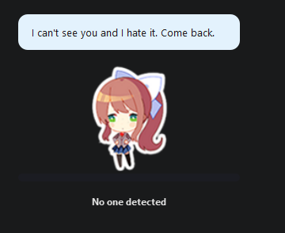
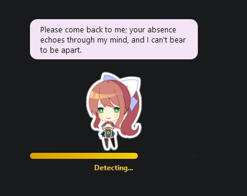
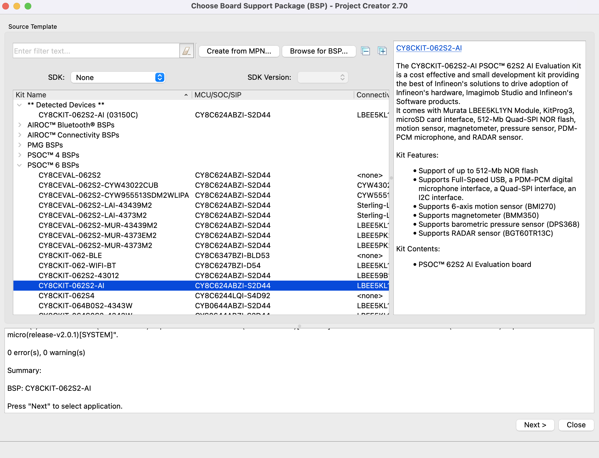
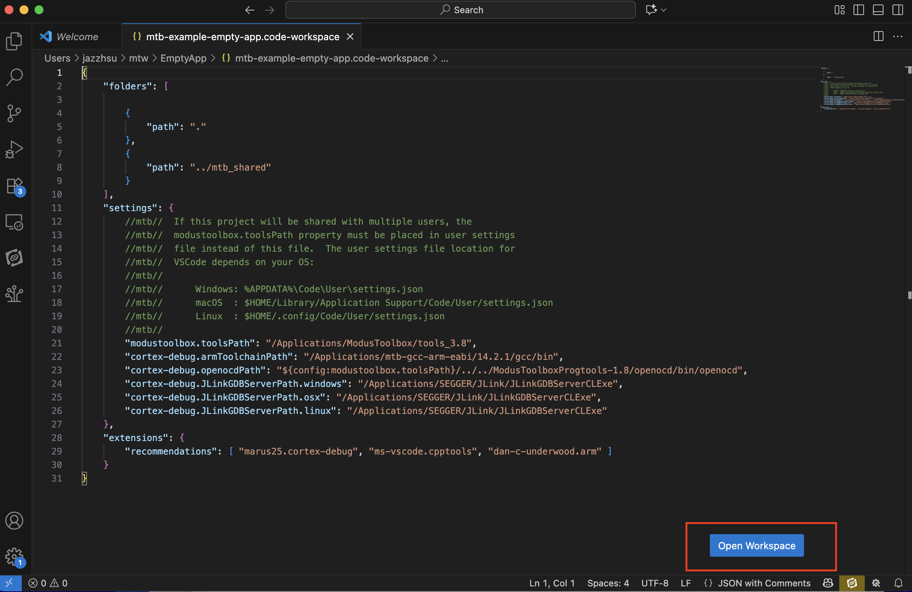

# Vital Sense (EmbIoT)

## Introduction

**Vital Sense** is a contactless heart-rate and breathing monitor built on the [Infineon CY8CKIT-062S2-AI](https://www.infineon.com/evaluation-board/CY8CKIT-062S2-AI) evaluation board. It uses the on-board BGT60TR13C 60 GHz FMCW radar to detect chest-wall micro-displacements caused by heartbeat and respiration — no wearable or skin contact required.

The system has two parts:

- **Firmware** (`main.c` + supporting files at repo root): reads raw radar frames from the BGT60TR13C and streams them to the host over USB-CDC.
- **Host app** (`host/`): runs on your PC, performs DSP (range FFT → phase unwrap → Butterworth bandpass → zero-crossing peak detection) and displays live BPM and breathing rate in a desktop companion UI.

**Key features**

| Feature | Detail |
|---|---|
| Detection range | ~50 cm (chest facing board) |
| BPM accuracy | ±5 BPM at rest after ~5 s warmup |
| Breathing rate | Concurrent with heart rate |
| UI refresh | 4 Hz |
| Modes | `--dsp pc` (hardware), `--dsp demo` (no hardware needed) |
| LLM dialogue | Optional — uses Anthropic or OpenAI API |

---

## Screenshots

| No one detected | Calibrating (adjusting) | Fully detected |
|:---:|:---:|:---:|
|  |  |  |
| Signal below threshold — Monika waits | Signal 80k–200k — yellow bar fills as you move closer | Signal above 200k — live BPM and breathing rate |

---

## Requirements

**Tested on Windows 11 and macOS**

- [ModusToolbox™](https://www.infineon.com/modustoolbox) v3.7 or later
- Python 3.11+ (tested with 3.14.4)
- Visual Studio Code
- 2 × USB-C cables

---

## Hardware Details

### Board and MCU

- **Board**: [Infineon CY8CKIT-062S2-AI](https://www.infineon.com/evaluation-board/CY8CKIT-062S2-AI)
- **MCU**: PSoC 6 CY8C6245AZI-S3D72 (Arm Cortex-M4 @ 150 MHz + Cortex-M0+)
- **Radar**: BGT60TR13C 60 GHz FMCW (on-board)

### RF Specifications

- Band: 60 GHz FMCW
- Antenna: on-board PCB patch array
- Operating distance: ~30–60 cm (chest-to-board, line-of-sight)
- Note: evaluation board only — no FCC/CE certification

### Power

- USB bus-powered via the KitProg3 USB-C port
- **KitProg3 USB-C** (programmer/debug side): powers the board AND exposes the debug UART (e.g. COM6 on Windows)
- **USER USB-C** (opposite side): exposes the raw radar data CDC stream (e.g. COM5 on Windows)
- **Both cables must be connected**: KitProg3 for power, USER USB for data

### Repo structure note

ModusToolbox requires `main.c` and `Makefile` at the project root, so firmware sources live at the top level rather than in a `firmware/` subfolder. Host code is in `host/`.

---

## Software Environment

### Firmware

| Item | Version |
|---|---|
| IDE / toolchain | ModusToolbox v3.7 |
| Compiler | GCC ARM (bundled with ModusToolbox) |
| SDK | mtb-hal-cat1, mtb-pdl-cat1 (pulled by Library Manager) |
| Radar library | sensor-xensiv-bgt60trxx |
| Build flags | `DEFINES=RAW_CAPTURE_DEBUG`, `COMPONENTS=USBD_BASE CMSIS_DSP` |

### Host software

| Item | Version |
|---|---|
| Language | Python 3.11+ |
| UI framework | PySide6 >= 6.7.0 |
| Sound (optional) | PySide6-Addons >= 6.7.0 |
| Serial | pyserial >= 3.5 |
| LLM (optional) | httpx >= 0.27.0 |
| OS tested | Windows 11, macOS |

---

## Setup

### Step 1 — Install ModusToolbox

Download and install [ModusToolbox Setup](https://www.infineon.com/design-resources/development-tools/sdk/modustoolbox-software).

Open **ModusToolbox Setup** (search Windows Start / macOS Spotlight). Register and log in (top-left corner), select **Default ModusToolbox Installation**, and install.

### Step 2 — Open the dashboard

Search for **ModusToolbox Dashboard** (Windows) or **dashboard.app** (macOS). At the top-right, select **Visual Studio Code** as your IDE.

### Step 3 — Create an Empty App project

Click **Launch Project Creator**.


- If the board is connected: select it under **Detected devices**.
- Otherwise: select **PSoC 6 BSPs → CY8CKIT-062S2-AI**.

Click **Next**, choose **Getting Started → Empty App**, set a name and path, click **Create**.



### Step 4 — Clone and copy this repo

```bash
git clone https://github.com/Jazzhsu/EmbIoT_VitalSense.git
```

Copy **everything** from the cloned repo into the empty-app folder from Step 3 (overwrite existing files).

### Step 5 — Open in VSCode

`File → Open File` → navigate to the empty-app folder → select `mtb-example-empty-app.code-workspace` → click **Open Workspace**.



### Step 6 — Install libraries

`Terminal → Run Task… → Tool: Library Manager` (continue without scanning).

Verify **sensor-xensiv-bgt60trxx** appears at the bottom of the library list. Click **Update**.

### Step 7 — Build firmware

`Terminal → Run Task… → Build`. First build takes a few minutes.

### Step 8 — Connect both USB-C cables

Plug **both** USB-C ports on the board into your PC before programming:
- **KitProg3** port (near the programmer chip) — powers the board
- **USER USB** port (opposite side) — data stream

### Step 9 — Flash firmware

`Terminal → Run Task… → Program`. Wait for programming to complete.

**Verify**: open the VSCode NRFConnect extension → connect to VCOM0 of device `3150C5A012D2400`. You should see:

```
****************** Vital Sense Application ******************

0:000 USBD_Start
BGT60TRXX setup complete
```

Reset or reprogram if no output appears.

### Step 10 — Find the data serial port

The board exposes **two** COM ports. You need the **USER USB** data port (not the KitProg3 debug port).

**Windows**: Open Device Manager → Ports (COM & LPT):
- `KitProg3 USB-UART` entry → this is the **debug** port (e.g. COM6) — **do not use**
- The second CDC entry → this is the **data** port (e.g. COM5) — **use this one**

You can also run `mode` in a Command Prompt and note which new port appears when you plug the USER USB cable.

**macOS**:
```bash
ls /dev/tty.usbmodem*
```
The data port is typically `/dev/tty.usbmodem24391` (exact suffix varies per board).

### Step 11 — Install Python dependencies

```bash
cd host
pip install -r requirements.txt
```

### Step 12 — Run the host app

Replace `COM5` with your actual data port:

**Windows**
```bash
python main.py --dsp pc --serial COM5
```

**macOS**
```bash
python main.py --dsp pc --serial /dev/tty.usbmodem24391
```

A frameless desktop companion (Monika) appears in the bottom-right corner. The system tray icon gives access to Settings and mode switching.

**To test without hardware** (no board required):
```bash
python main.py --dsp demo
```

### Step 13 — Operate

- Place the board on your desk facing your chest at ~50 cm.
- Keep the board still and stay seated.
- After ~5 seconds the companion transitions from **calibrating** to **normal** and shows live `♥ BPM` and breathing rate.
- Walk away → companion transitions to **no signal**.

---

## Performance

| Metric | Value |
|---|---|
| Detection range | ~30–60 cm |
| BPM accuracy | ±5 BPM at rest |
| Breathing rate accuracy | ±2 breaths/min at rest |
| Presence detection threshold | mean \|spectrum\| peak > 100 000 |
| UI refresh | 4 Hz |
| End-to-end latency | ~1 s |
| State debounce | ~750 ms (3 consecutive samples) |

---

## Limitations and Future Work

- **Single target**: the algorithm tracks the strongest range bin; multiple people in the field of view will confuse BPM extraction.
- **Near-stationary required**: large body movement (typing, leaning) corrupts the phase signal.
- **PC-side DSP**: the current build streams raw frames to the PC (`--dsp pc`). An edge DSP path (`--dsp edge`) exists in firmware but is not yet validated.
- **No clinical validation**: intended for personal awareness / demonstration only.
- **Future**: on-board edge inference (CM4), multi-target tracking, battery + enclosure, voice feedback.

---

## Troubleshooting

**Wrong COM port / no data**
Unplug and replug the USER USB cable and check which new port appears in Device Manager — that is the data port. The KitProg3 port carries debug UART, not radar data.

**App window has white border**
The Windows 11 DWM rounded-corner fix is applied automatically at startup. Toggle the window from the tray icon if it reappears.

**Monika sprite is blank**
The sprite PNGs must be present in `host/assets/`. Copy the Shimeji image set (`idle1–9.png`, `food1–4.png`, `sit1–4.png`, etc.) into that folder.

**LLM dialogue not updating**
Open Settings (tray → Settings…) and paste an Anthropic or OpenAI API key. The app falls back to canned offline dialogue without a key.

**Calibrating state never ends**
- Confirm you are seated ~50 cm from the board with your chest facing it.
- Confirm the **USER USB** cable (not just KitProg3) is connected and the correct COM port is passed with `--serial`.

**`pip install` fails on PySide6-Addons**
Requires Python 3.11+. Upgrade Python and re-run `pip install -r requirements.txt`.

---

## Security Notes

The optional LLM API key is stored in plain text in `~/.vita/settings.json`. Use a project-scoped key with spending limits. Never commit a real API key to the repository — use placeholder text and instruct collaborators to add their own.

---

## License

See [LICENSE](LICENSE).
