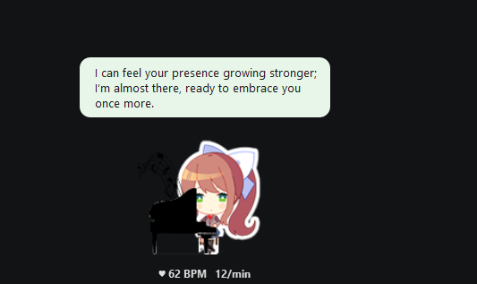

# Vital Sense — Your Heart's Companion

Vital Sense turns an Infineon CY8CKIT-062S2-AI evaluation board into a passive, contactless heart-rate and breathing monitor. The on-board BGT60TR13C 60 GHz FMCW radar detects the tiny chest-wall displacements your heartbeat and breath create — at up to 50 cm away, through your shirt, without touching anything.

Raw radar frames stream over USB-CDC to a PC-side DSP pipeline: range FFT locks onto your range bin, phase unwrapping extracts chest displacement, and a dual Butterworth bandpass separates your breathing signal (~0.1–0.5 Hz) from your heartbeat (~0.8–2.5 Hz). Zero-crossing counting delivers a live BPM and breathing rate, refreshed four times per second.

The results appear in a Monika-style desktop companion — a frameless always-on-top window that sits quietly in the corner of your screen, shows your heart rate in real time, and speaks up when it senses stress or long focus sessions. An optional LLM API key (Anthropic or OpenAI) upgrades the dialogue to fully context-aware responses.

No wearable subscription. No chest strap. Just sit down, face the board, and let the radar do the rest.

**Key results**: live BPM within ±5 BPM at rest, breathing rate within ±2 breaths/min, ~1 s end-to-end latency, detection range 30–90 cm.

